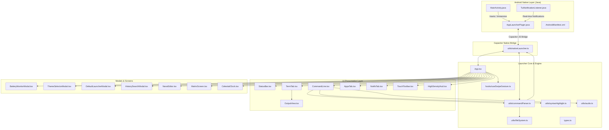

# Android Terminal Launcher (TUI) — Technical Codebase Documentation

> **Complete Architecture, File-by-File Reference, and Dependency Linkage Guide**

---

## 1. System Architecture Overview

The **Android Terminal Launcher (TUI)** is a keyboard-driven, hacker-aesthetic home screen and command shell for Android devices. Built using **React 19**, **TypeScript**, **Tailwind CSS v4**, **Vite**, and **Capacitor 8**, it operates both as a native Android launcher (APK) and as a progressive web application (PWA).

### High-Level Architecture Flow



---

## 2. Directory Structure

```
tui_launcher/
├── android/                                    # Android Native Studio Project
│   └── app/src/main/java/com/android/terminal/launcher/
│       ├── MainActivity.java                   # Immersive fullscreen & gesture navigation host
│       ├── AppLauncherPlugin.java              # Capacitor native bridge to Android OS APIs
│       └── TuiNotificationListener.java        # NotificationListenerService daemon
├── src/
│   ├── main.tsx                                # React application entry point
│   ├── App.tsx                                 # Root component, state hub & coordinator
│   ├── types.ts                                # Global TypeScript data models & contracts
│   ├── index.css                               # Tailwind CSS v4, CRT effects & animations
│   ├── components/                             # React Presentation Components
│   │   ├── AppsTab.tsx                         # App drawer & applications grid
│   │   ├── BatteryMonitorModal.tsx             # Hardware battery telemetry & diagnostics modal
│   │   ├── CelestialClock.tsx                  # Astronomical chronometer & lunar phase modal
│   │   ├── CommandLine.tsx                     # Terminal input line with ghost autocomplete
│   │   ├── DefaultLauncherModal.tsx            # Set default launcher & gesture tutorial modal
│   │   ├── ErrorBoundary.tsx                   # React UI error catcher & diagnostics
│   │   ├── HighDensityHud.tsx                  # Desktop/tablet right HUD sidebar
│   │   ├── HistorySearchModal.tsx              # Reverse command history fuzzy search (Ctrl+R)
│   │   ├── MatrixScreen.tsx                    # Matrix digital rain screensaver canvas
│   │   ├── NanoEditor.tsx                      # In-app terminal text editor (nano/vim clone)
│   │   ├── NotifsTab.tsx                       # Grouped notification shade & management
│   │   ├── OutputView.tsx                      # Terminal output stream with ANSI/custom formatting
│   │   ├── StatusBar.tsx                       # Top system status bar & section switcher
│   │   ├── TermTab.tsx                         # Interactive terminal view container
│   │   ├── ThemeSelectorModal.tsx              # CRT & cyberpunk theme customizer modal
│   │   └── TouchToolbar.tsx                    # Bottom mobile touchscreen key toolbar
│   ├── data/                                   # Data Stores & Default Collections
│   │   ├── defaultApps.ts                      # Fallback application list for web/sandboxes
│   │   ├── defaultData.ts                      # Default config, aliases, and initial virtual FS
│   │   └── themes.ts                           # Built-in cyberpunk & CRT color themes
│   ├── hooks/                                  # Reusable Custom React Hooks
│   │   ├── usePWAInstall.ts                    # Browser PWA installation prompt handler
│   │   └── useSwipeGesture.ts                  # Touch swipe detection for tab cycling
│   └── utils/                                  # Utility Libraries & Subsystems
│       ├── audio.ts                            # Web Audio API mechanical sound effects synthesizer
│       ├── commandParser.ts                    # Terminal shell command execution engine
│       ├── fileSystem.ts                       # Virtual in-memory Linux filesystem
│       ├── nativeLauncher.ts                   # TypeScript bridge to Android Capacitor plugin
│       └── syntaxHighlight.ts                  # Lexer for real-time command syntax coloring
├── capacitor.config.json                       # Capacitor mobile runtime configuration
├── vite.config.ts                              # Vite build, PWA & React plugin config
├── tsconfig.json                               # Strict TypeScript configuration
└── package.json                                # Project dependencies and build scripts
```

---

## 3. Detailed File-by-File Documentation

### 3.1 Application Entry & Global State Core

#### `src/main.tsx`
- **Purpose**: Boots the React application, attaches to the DOM root element (`#root`), and wraps the entire tree with `ErrorBoundary` to guarantee zero unhandled runtime crashes.
- **Linkage**:
  - **Imports**: `React`, `ReactDOM`, `App.tsx`, `ErrorBoundary.tsx`, `index.css`.
  - **Exported To**: Loaded by `index.html` via `<script type="module" src="/src/main.tsx">`.
- **Data Flow**: Invokes `ReactDOM.createRoot()`, wraps `<App />` inside `<ErrorBoundary>`, and handles fatal error diagnostics.

#### `src/App.tsx`
- **Purpose**: The central coordinator and state container of the entire launcher. Manages active tabs (`apps`, `notifs`, `term`), persistent configurations, terminal history, contacts, call logs, notifications, battery diagnostics, active modals, and coordinates hardware sync with Android.
- **Key State Variables**:
  - `activeTab`: Currently displayed section (`'apps' | 'notifs' | 'term'`).
  - `config`: User launcher preferences (`LauncherConfig`).
  - `lines`: History of terminal output lines (`TerminalLine[]`).
  - `apps`: Installed Android applications (`AndroidApp[]`).
  - `notifications`: Real-time system notifications (`AppNotification[]`).
  - `contacts`: Phone contacts synced from Android (`ContactItem[]`).
  - `recentCalls`: Call history synced from Android (`RecentCall[]`).
  - `bluetoothState`: Bluetooth adapter and paired devices (`BluetoothState`).
  - `batteryLevel`, `isCharging`: Real-time power telemetry.
- **Linkage**:
  - **Imports**: All components (`StatusBar`, `TermTab`, `AppsTab`, `NotifsTab`, `CommandLine`, `TouchToolbar`, `HighDensityHud`, and all modals), custom hooks (`useSwipeGesture`, `usePWAInstall`), native utilities (`nativeLauncher`), audio manager (`audio`), and data defaults (`defaultData`, `themes`).
  - **Used By**: Root application component rendered by `src/main.tsx`.
- **Data Flow**:
  - Listens to native Android events via `nativeLauncher.ts` on startup (apps, contacts, call logs, battery, bluetooth).
  - Supplies context, handlers, and state down to child tabs and modals.
  - Receives command execution requests from `CommandLine` and routes them through `commandParser.ts`.
  - Handles swipe transitions via `useSwipeGesture.ts` to switch between `apps`, `notifs`, and `term`.

#### `src/types.ts`
- **Purpose**: Defines standard TypeScript interfaces, types, and data models used across the application.
- **Key Interfaces**:
  - `Theme`: Theme colors, CRT scanline flags, font families.
  - `AppNotification`: Grouped notifications, app IDs, actions, and priority.
  - `TerminalLine`: Terminal output lines (type, prompt, command, content).
  - `AndroidApp`: Application details, package name, icon, lastUsed, favorites.
  - `CustomScript`: Shell scripts created in `nano` or virtual filesystem.
  - `Alias`: Custom shorthand shell commands.
  - `ContactItem`: Contact details (ID, name, phone, email).
  - `RecentCall`: Android call log items (timestamp, type, duration, phone).
  - `BluetoothDevice` & `BluetoothState`: Bluetooth adapter telemetry.
  - `BatteryTelemetry`: Voltage (mV), temperature (°C), current (mA), power (W), cycle count, health.
  - `VirtualFile`: Virtual Linux directory node hierarchy.
- **Linkage**:
  - **Imported By**: Almost every file in `src/` (`App.tsx`, `commandParser.ts`, `CommandLine.tsx`, `nativeLauncher.ts`, `defaultData.ts`, `HighDensityHud.tsx`, etc.).

#### `src/index.css`
- **Purpose**: Stylesheet providing Tailwind CSS v4 setup, CRT monitor scanline simulation (`.crt-scanlines`), vignette overlay (`.crt-vignette`), terminal phosphor glow, custom slim scrollbars, and terminal cursor blink animations.
- **Linkage**:
  - **Imported By**: `src/main.tsx`.

---

### 3.2 Terminal & Command Execution Engine

#### `src/utils/commandParser.ts`
- **Purpose**: The terminal shell command interpreter and execution engine. Parses user command strings, flags, and arguments, and returns structured `CommandResult` output or initiates hardware actions.
- **Key Supported Commands**:
  - `apps`, `open <app>`, `uninstall <app>`: Application execution and management.
  - `call <contact|number>`, `dial`: Places native phone calls or launches phone dialer.
  - `sms <contact|number> [message]`: Dispatches native Android SMS messaging app.
  - `notifications` / `notifs`: Views grouped notification shade or test alerts.
  - `battery`, `battery monitor`: Opens battery monitor or prints telemetry.
  - `wifi`, `hotspot`: Network inspection and hotspot management.
  - `bluetooth`, `bt`: Scans, connects, and controls Bluetooth peripherals.
  - `theme`, `themes`: Switches color schemes or toggles CRT scanline effects.
  - `contact add`, `contacts`: Contacts directory inspection and creation.
  - `ls`, `cd`, `cat`, `mkdir`, `rm`, `touch`: Virtual Linux filesystem operations.
  - `nano <file>`: Launches the built-in terminal text editor.
  - `run <script.sh>`: Executes custom shell scripts.
  - `matrix`: Launches fullscreen digital rain screensaver.
  - `sysinfo`, `neofetch`: System hardware and OS platform diagnostic summaries.
- **Linkage**:
  - **Imports**: `types.ts`, `fileSystem.ts`, `nativeLauncher.ts`, `audio.ts`, `themes.ts`.
  - **Exported To**: `src/App.tsx`, `src/components/CommandLine.tsx`, `src/components/OutputView.tsx`.
- **Data Flow**: Accepts raw input text and execution context `CommandContext`, executes the command asynchronously, mutates state (via context callbacks), and returns styled terminal lines.

#### `src/utils/fileSystem.ts`
- **Purpose**: Provides an in-memory virtual hierarchical Linux filesystem (`VirtualFS`). Simulates paths (`~`, `/home/u0_a284`), directories, file read/write, permissions, and automatically persists to `localStorage`.
- **Linkage**:
  - **Imports**: `types.ts`, `defaultData.ts`.
  - **Exported To**: `commandParser.ts`, `CommandLine.tsx`, `NanoEditor.tsx`.
- **Data Flow**: `commandParser.ts` invokes `virtualFS` for standard shell commands (`ls`, `cat`, `mkdir`, `rm`, `touch`), and `NanoEditor.tsx` loads and saves file contents directly through it.

#### `src/utils/syntaxHighlight.ts`
- **Purpose**: Lexical scanner that breaks input command strings into colored syntax tokens (`command`, `subcommand`, `flag`, `string`, `path`, `operator`, `variable`).
- **Linkage**:
  - **Imports**: None (self-contained utility).
  - **Exported To**: `src/components/CommandLine.tsx`.
- **Data Flow**: Takes the live terminal input string and returns `SyntaxToken[]` to render colored text under the transparent typing input box.

#### `src/utils/audio.ts`
- **Purpose**: Hardware sound effects synthesizer utilizing the standard **Web Audio API**. Generates tactile mechanical keyboard clicks, CRT power-on hums, error buzzes, and success chimes with zero external audio assets.
- **Linkage**:
  - **Imports**: None (pure browser AudioContext implementation).
  - **Exported To**: `App.tsx`, `CommandLine.tsx`, `OutputView.tsx`, `AppsTab.tsx`, `NotifsTab.tsx`, `TouchToolbar.tsx`, `HighDensityHud.tsx`.
- **Data Flow**: Components call `soundManager.playKeyClick()`, `soundManager.playSuccess()`, or `soundManager.playError()` to give tactile auditory feedback on user actions.

---

### 3.3 Hardware & Native Android Bridge Layer

#### `src/utils/nativeLauncher.ts`
- **Purpose**: TypeScript bridge interface to the Capacitor native plugin (`AppLauncherPlugin.java`). Detects native vs. browser environments and provides graceful fallbacks for web testing.
- **Key Bridge APIs**:
  - `launchNativeApp(packageName)`: Launches Android application via native Intent.
  - `uninstallNativeApp(packageName)`: Triggers system package uninstaller dialog.
  - `getDeviceContacts()`: Queries contacts from Android `ContactsContract`.
  - `getDeviceRecentCalls()`: Queries recent call logs from Android `CallLog`.
  - `dialNativePhoneNumber(number)`: Dispatches phone call via native dialer.
  - `sendNativeSms(number, message)`: Dispatches SMS via default messaging app.
  - `toggleNativeTorch(enable)`: Controls camera flash LED via `CameraManager`.
  - `getDeviceBatteryTelemetry()`: Reads hardware battery telemetry.
  - `setNativeGestureNavigationMode(enable)`: Requests immersive full-screen gesture mode and opens system gesture settings.
  - `openAndroidHomeSettings()`: Prompts the user to set TUI Launcher as the permanent default home app.
- **Linkage**:
  - **Imports**: `@capacitor/core`, `types.ts`.
  - **Exported To**: `src/App.tsx`, `src/utils/commandParser.ts`, `src/components/CommandLine.tsx`, `src/components/DefaultLauncherModal.tsx`.
- **Data Flow**: Translates JavaScript calls into `AppLauncher.<method>()` over the Capacitor bridge and returns parsed Android system responses.

#### `android/app/src/main/java/com/android/terminal/launcher/MainActivity.java`
- **Purpose**: Native Android entry Activity. Configures edge-to-edge transparent system windows, hides the legacy 3-button navigation bar, and enforces sticky immersive gesture mode.
- **Linkage**:
  - **Extends**: `com.getcapacitor.BridgeActivity`.
  - **Collaborates With**: `AppLauncherPlugin.java`, `AndroidManifest.xml`.
- **Key Methods**:
  - `setupImmersiveGestureMode()`: Uses `WindowInsetsControllerCompat` to hide navigation bars and set `BEHAVIOR_SHOW_TRANSIENT_BARS_BY_SWIPE`.

#### `android/app/src/main/java/com/android/terminal/launcher/AppLauncherPlugin.java`
- **Purpose**: Custom Capacitor native plugin implementing Android hardware integration.
- **Key Capabilities**:
  - `getInstalledApps`: Scans installed apps using `PackageManager.queryIntentActivities`.
  - `openApp`: Launches app by package name with `FLAG_ACTIVITY_NEW_TASK`.
  - `getDeviceContacts`: Reads names and numbers from `ContactsContract.CommonDataKinds.Phone`.
  - `getDeviceRecentCalls`: Reads call type, duration, and phone from `CallLog.Calls`.
  - `dialPhoneNumber`: Launches `Intent.ACTION_DIAL`.
  - `sendSms`: Launches `Intent.ACTION_SENDTO` with `sms:` or `smsto:` URI.
  - `setGestureNavigationMode`: Changes window insets and launches `android.settings.SYSTEM_NAVIGATION_SETTINGS`.
  - `setTorch`: Toggles camera flash via `CameraManager.setTorchMode()`.
  - `getBatteryTelemetry`: Reads voltage, temperature, current, and capacity from `BatteryManager`.
- **Linkage**:
  - **Registered In**: Loaded automatically by Capacitor runtime for `AppLauncher`.
  - **Linked With**: Invoked from TypeScript via `src/utils/nativeLauncher.ts`.

#### `android/app/src/main/java/com/android/terminal/launcher/TuiNotificationListener.java`
- **Purpose**: Background `NotificationListenerService` that intercepts Android system notifications in real time and posts them to `AppLauncherPlugin` so the launcher shade stays updated.
- **Linkage**:
  - **Registered In**: `AndroidManifest.xml` under service with permission `BIND_NOTIFICATION_LISTENER_SERVICE`.
  - **Collaborates With**: `AppLauncherPlugin.java` notification broadcast receiver.

#### `android/app/build.gradle` & `android/app/debug.keystore`
- **Purpose**: Gradle build configuration and permanent signing keystore ensuring reproducible, collision-free APK builds.
- **Key Capabilities**:
  - `computeVersionCode()`: Automatically calculates ever-increasing `versionCode` based on git commit count (`git rev-list --count HEAD`) with manual override support via `-PcustomVersionCode=`.
  - `signingConfigs.debug` & `signingConfigs.release`: Links builds to the persistent `debug.keystore` (valid until 2054) so that local builds, CI builds, and re-compilations share the exact same signature certificate.
  - **Prevents Package Conflicts**: Fixes Android's `INSTALL_FAILED_UPDATE_INCOMPATIBLE` ("App not installed as package conflicts with an existing package") when updating an existing installation after code edits.

---

### 3.4 Main Interface Views & Tabs

#### `src/components/TermTab.tsx`
- **Purpose**: Hosts the interactive terminal experience. Contains the session header bar (showing tty, line counts, and quick action chips like Clear, Help, Neofetch, Battery) and nests `OutputView`.
- **Linkage**:
  - **Imports**: `React`, `types.ts`, `OutputView.tsx`, `audio.ts`.
  - **Used By**: `src/App.tsx` (rendered when `activeTab === 'term'`).
- **Data Flow**: Receives `lines` from `App.tsx` and passes them to `OutputView`. Emits quick command execution events upward to `App.tsx`.

#### `src/components/OutputView.tsx`
- **Purpose**: Renders the continuous terminal output stream. Supports syntax rendering, tabular data, ascii art, app lists, grouped notifications, weather cards, and auto-scrolls to the newest output.
- **Linkage**:
  - **Imports**: `React`, `types.ts`, `audio.ts`.
  - **Used By**: `src/components/TermTab.tsx`.
- **Data Flow**: Renders `TerminalLine[]` items with appropriate visual styling based on line type (`output`, `error`, `success`, `system`, `weather`, `app_list`, `notifications_grouped`).

#### `src/components/CommandLine.tsx`
- **Purpose**: The interactive command prompt. Combines transparent `<input>` with an underlying syntax-highlighted token layer and an intelligent autocomplete/action popover.
- **Autocomplete & Action Features**:
  - **App launch**: Typing `open <app>` shows app suggestions with instant `[Launch]` buttons.
  - **App removal**: Typing `uninstall <app>` shows packages with instant `[Uninstall]` buttons.
  - **Call & Quick Dial**: Typing `call ` or `dial ` shows non-overlapping contact suggestions. Prioritizes **Recent Calls first**, followed by Contacts Directory, with direct `[Call]` buttons.
  - **SMS messaging**: Typing `sms ` shows contacts with instant `[SMS]` buttons.
  - **Bluetooth management**: Typing `bluetooth ` shows paired devices with instant `[Connect]` / `[Disconnect]` buttons.
  - **Fish/Zsh Ghost Suggestion**: Displays inline dimmed predictive text. Pressing `[Tab]` or `[→]` autocompletes.
- **Linkage**:
  - **Imports**: `types.ts`, `syntaxHighlight.ts`, `fileSystem.ts`, `audio.ts`.
  - **Used By**: `src/App.tsx`.
- **Data Flow**: Emits submitted command strings to `App.tsx` (`handleExecuteCommand`). Consults `apps`, `contacts`, `recentCalls`, and `bluetoothState` to construct suggestion lists.

#### `src/components/AppsTab.tsx`
- **Purpose**: Visual application drawer and launcher grid. Displays installed apps grouped by category, search filter, favorites pin/unpin, and native launch/uninstall triggers.
- **Linkage**:
  - **Imports**: `React`, `types.ts`, `audio.ts`, `nativeLauncher.ts`.
  - **Used By**: `src/App.tsx` (rendered when `activeTab === 'apps'`).
- **Data Flow**: Receives `apps` from `App.tsx`, filters by user query, and invokes `onOpenApp` or `onToggleFavorite`.

#### `src/components/NotifsTab.tsx`
- **Purpose**: Mobile notification shade. Groups notifications by application, displays alert count badges, chronological time ago, clear actions, and direct app launch buttons.
- **Linkage**:
  - **Imports**: `React`, `types.ts`, `audio.ts`.
  - **Used By**: `src/App.tsx` (rendered when `activeTab === 'notifs'`).
- **Data Flow**: Receives `notifications` from `App.tsx`. Dispatches clear or launch commands back to `App.tsx`.

#### `src/components/StatusBar.tsx`
- **Purpose**: Fixed top status bar. Displays battery percentage/charging icon, current time, network status, active tab pills (`Apps (Ctrl+1)`, `Notifs (Ctrl+2)`, `Term (Ctrl+3)`), quick theme toggle, and audio toggle.
- **Linkage**:
  - **Imports**: `React`, `types.ts`, `audio.ts`.
  - **Used By**: `src/App.tsx`.
- **Data Flow**: Directly controls section switching and triggers the battery diagnostics modal.

#### `src/components/TouchToolbar.tsx`
- **Purpose**: On-screen tactile keyboard helper bar for mobile touch screens. Provides essential keys often missing or awkward on virtual mobile keyboards: `Tab`, `Esc`, `Ctrl`, `Up`, `Down`, `Clear`, `Help`, `Apps`, `Term`, `Notifs`.
- **Linkage**:
  - **Imports**: `React`, `types.ts`, `audio.ts`.
  - **Used By**: `src/App.tsx`.
- **Data Flow**: Fires `onKeyPress(key)` events to `App.tsx` to manipulate the command line cursor or switch sections.

#### `src/components/HighDensityHud.tsx`
- **Purpose**: Desktop and tablet right-side HUD sidebar. Displays high-density widgets: recently used apps with hotkeys, custom shell aliases, live notification feeds, hardware power diagnostics card, and weather telemetry.
- **Linkage**:
  - **Imports**: `React`, `types.ts`, `audio.ts`.
  - **Used By**: `src/App.tsx` (rendered on `lg:` screens).
- **Data Flow**: Triggers app launches or command execution directly through `onRunCommand`.

---

### 3.5 Modals & Interactive Screens

#### `src/components/BatteryMonitorModal.tsx`
- **Purpose**: Detailed hardware battery diagnostics modal. Displays real-time voltage (mV), cell temperature (°C), current flow (mA), power consumption (W), estimated remaining battery runtime, power saver toggle, 24-hour discharge history chart, and per-app power consumption ranking.
- **Linkage**:
  - **Imports**: `React`, `types.ts`, `audio.ts`.
  - **Used By**: `src/App.tsx` (opened via `battery monitor` command, status bar battery icon, or TouchToolbar).

#### `src/components/ThemeSelectorModal.tsx`
- **Purpose**: Visual theme selector dialog. Allows users to preview and select from built-in cyberpunk, CRT, retro, and modern themes (`High Density`, `Matrix`, `Cyberpunk`, `Synthwave`, `Dracula`, `Nord`, etc.), toggle CRT scanlines, and toggle phosphor bloom.
- **Linkage**:
  - **Imports**: `React`, `types.ts`, `themes.ts`, `audio.ts`.
  - **Used By**: `src/App.tsx` (opened via `theme` command, `Alt+T`, or status bar).

#### `src/components/DefaultLauncherModal.tsx`
- **Purpose**: Interactive setup modal to guide the user in setting TUI Launcher as their permanent Android home app. Includes instructions for enabling full-screen gesture navigation, hiding 3-button bars, ADB permissions, and GitHub Actions APK downloads.
- **Linkage**:
  - **Imports**: `React`, `types.ts`, `audio.ts`, `nativeLauncher.ts`.
  - **Used By**: `src/App.tsx` (opened via `set-default-launcher` or TouchToolbar).

#### `src/components/HistorySearchModal.tsx`
- **Purpose**: Reverse history search dialog (`Ctrl+R`). Provides real-time fuzzy filtering across past shell commands with instant recall and execution.
- **Linkage**:
  - **Imports**: `React`, `types.ts`, `audio.ts`.
  - **Used By**: `src/App.tsx` (opened via `history search` or keyboard shortcut `Ctrl+R`).

#### `src/components/NanoEditor.tsx`
- **Purpose**: Terminal text editor mimicking `nano` and `vim`. Allows editing shell scripts and virtual files directly inside the launcher with line numbers, status bar, shortcut hints, and save/exit operations.
- **Linkage**:
  - **Imports**: `React`, `types.ts`, `fileSystem.ts`, `audio.ts`.
  - **Used By**: `src/App.tsx` (opened via `nano <file>` command).

#### `src/components/CelestialClock.tsx`
- **Purpose**: Astronomical analog clock and chronometer modal showing UTC, local time, and lunar phase.
- **Linkage**:
  - **Imports**: `React`, `types.ts`.
  - **Used By**: `src/App.tsx` (opened via `clock` or `celestial` command).

#### `src/components/MatrixScreen.tsx`
- **Purpose**: High-performance HTML5 `<canvas>` screensaver rendering animated digital rain inspired by *The Matrix*. Exits immediately upon any touch or keypress.
- **Linkage**:
  - **Imports**: `React`.
  - **Used By**: `src/App.tsx` (opened via `matrix` or `rain` command).

#### `src/components/ErrorBoundary.tsx`
- **Purpose**: React Class Error Boundary that catches component rendering exceptions, captures stack traces, and displays a terminal-themed crash screen with safe reset and reboot options.
- **Linkage**:
  - **Imports**: `React`.
  - **Used By**: `src/main.tsx`.

---

### 3.6 Data Collections & Presets

#### `src/data/defaultData.ts`
- **Purpose**: Supplies default initial configurations:
  - `DEFAULT_CONFIG`: Default font family, font size, prompt symbols, sound settings.
  - `DEFAULT_ALIASES`: Built-in shortcuts (`ll` -> `ls -la`, `cls` -> `clear`, `fetch` -> `neofetch`, etc.).
  - `DEFAULT_CONTACTS`: Empty initial array (`[]`) ensuring zero fake phone numbers.
  - `DEFAULT_RECENT_CALLS`: Empty initial array (`[]`) ensuring zero fake call records.
  - `INITIAL_FILESYSTEM`: Default virtual directory layout (`/storage/emulated/0`).
  - `DEFAULT_HOTSPOT_STATE`: Default Wi-Fi hotspot configuration parameters.
- **Linkage**:
  - **Imported By**: `src/App.tsx`, `src/utils/fileSystem.ts`.

#### `src/data/defaultApps.ts`
- **Purpose**: Fallback list of standard Android applications (`Camera`, `Phone`, `Messages`, `Settings`, `Files`, `Chrome Browser`, `Spotify`, etc.) used when running outside native Android or before permission is granted.
- **Linkage**:
  - **Imported By**: `src/App.tsx`.

#### `src/data/themes.ts`
- **Purpose**: Catalog of predefined themes (`high-density`, `matrix`, `cyberpunk`, `amber-crt`, `hacker-green`, `synthwave`, `dracula`, `nord`, `monokai`, `solarized-dark`, `solarized-light`).
- **Linkage**:
  - **Imported By**: `src/App.tsx`, `src/components/ThemeSelectorModal.tsx`, `src/utils/commandParser.ts`.

---

### 3.7 Custom Hooks

#### `src/hooks/useSwipeGesture.ts`
- **Purpose**: Single-finger touch gesture recognizer. Detects left and right horizontal swipes to smoothly navigate between `Apps`, `Notifs`, and `Term`.
- **Key Logic**:
  - Differentiates horizontal swipes from vertical scrolling (`Math.abs(deltaX) > Math.abs(deltaY) * 1.3`).
  - Enforces minimum swipe distance threshold (45px).
  - Ignores swipes originating inside input fields, textareas, sliders, or open modals.
- **Linkage**:
  - **Imports**: `useRef`, `useEffect`.
  - **Exported To**: `src/App.tsx`.

#### `src/hooks/usePWAInstall.ts`
- **Purpose**: Captures the browser's `beforeinstallprompt` event and exposes `promptInstall()` and `isInstallable` state to allow progressive web app installation.
- **Linkage**:
  - **Imports**: `useState`, `useEffect`.
  - **Exported To**: `src/App.tsx`, `src/components/DefaultLauncherModal.tsx`.

---

### 3.8 Build & Runtime Configuration Files

#### `vite.config.ts`
- Configures Vite bundler, `@vitejs/plugin-react`, `@tailwindcss/vite`, and `vite-plugin-pwa`. Sets up progressive web app manifest, icon assets, and offline service worker generation.

#### `capacitor.config.json`
- Configures the Capacitor bridge runtime:
  - `appId`: `com.android.terminal.launcher`
  - `appName`: `TUI Launcher`
  - `webDir`: `dist`

#### `package.json`
- Defines project metadata (version 1.3.0), scripts (`dev`, `build`, `lint`, `clean`), and dependencies (`@capacitor/core`, `@capacitor/android`, `react`, `lucide-react`, `tailwindcss`, `vite`).

#### `tsconfig.json`
- Configures strict TypeScript compilation targeting modern ESNext syntax with React JSX support and type safety checks.

---

## 4. Component Dependency & Linkage Matrix

| File / Component | Primary Responsibility | Direct Dependencies (Imports) | Consumed By (Imported In) |
| :--- | :--- | :--- | :--- |
| **`main.tsx`** | DOM bootstrapping | `App.tsx`, `ErrorBoundary.tsx`, `index.css` | `index.html` |
| **`App.tsx`** | State hub, routing, hardware sync | Tabs, Modals, Hooks, Native Utils, Data | `main.tsx` |
| **`types.ts`** | Type contracts & data structures | None | Entire codebase |
| **`commandParser.ts`** | Shell command interpreter | `types.ts`, `fileSystem.ts`, `nativeLauncher.ts`, `audio.ts` | `App.tsx`, `CommandLine.tsx` |
| **`nativeLauncher.ts`** | Android Capacitor bridge | `@capacitor/core`, `types.ts` | `App.tsx`, `commandParser.ts`, `CommandLine.tsx` |
| **`fileSystem.ts`** | Virtual Linux filesystem | `types.ts`, `defaultData.ts` | `commandParser.ts`, `CommandLine.tsx`, `NanoEditor.tsx` |
| **`syntaxHighlight.ts`**| Command token coloring | None | `CommandLine.tsx` |
| **`audio.ts`** | Web Audio sound synthesis | None | `App.tsx`, `CommandLine.tsx`, Tabs |
| **`useSwipeGesture.ts`**| Left/Right tab touch swipe | React hooks | `App.tsx` |
| **`CommandLine.tsx`** | Input line & auto-popup | `types.ts`, `syntaxHighlight.ts`, `audio.ts` | `App.tsx` |
| **`TermTab.tsx`** | Terminal tab view container | `types.ts`, `OutputView.tsx`, `audio.ts` | `App.tsx` |
| **`OutputView.tsx`** | Terminal output stream renderer | `types.ts`, `audio.ts` | `TermTab.tsx` |
| **`AppsTab.tsx`** | App grid & search drawer | `types.ts`, `audio.ts`, `nativeLauncher.ts` | `App.tsx` |
| **`NotifsTab.tsx`** | Notification shade | `types.ts`, `audio.ts` | `App.tsx` |
| **`StatusBar.tsx`** | Top status & telemetry bar | `types.ts`, `audio.ts` | `App.tsx` |
| **`TouchToolbar.tsx`** | Bottom mobile keypad | `types.ts`, `audio.ts` | `App.tsx` |
| **`HighDensityHud.tsx`**| Desktop/tablet right HUD | `types.ts`, `audio.ts` | `App.tsx` |
| **`BatteryMonitorModal`**| Power diagnostics dialog | `types.ts`, `audio.ts` | `App.tsx` |
| **`ThemeSelectorModal`**| Theme picker dialog | `types.ts`, `themes.ts`, `audio.ts` | `App.tsx` |
| **`DefaultLauncherModal`**| Home launcher tutorial | `types.ts`, `nativeLauncher.ts`, `audio.ts` | `App.tsx` |
| **`HistorySearchModal`**| Command reverse search | `types.ts`, `audio.ts` | `App.tsx` |
| **`NanoEditor.tsx`** | Micro in-app text editor | `types.ts`, `fileSystem.ts`, `audio.ts` | `App.tsx` |
| **`MatrixScreen.tsx`** | Digital rain screensaver | None | `App.tsx` |
| **`CelestialClock.tsx`**| Astronomical clock modal | `types.ts` | `App.tsx` |
| **`ErrorBoundary.tsx`**| Crash safety catcher | None | `main.tsx` |
| **`defaultData.ts`** | Initial settings & defaults | `types.ts` | `App.tsx`, `fileSystem.ts` |
| **`themes.ts`** | Color palettes & presets | `types.ts` | `App.tsx`, `ThemeSelectorModal.tsx` |
| **`defaultApps.ts`** | Web fallback applications | `types.ts` | `App.tsx` |

---

## 5. End-to-End Data Flow Lifecycles

### 5.1 Application Startup Lifecycle
1. `index.html` loads `src/main.tsx`.
2. `main.tsx` wraps `<App />` inside `<ErrorBoundary />` and mounts into `#root`.
3. `App.tsx` initializes local states (`config`, `history`, `contacts`, `recentCalls`, `todos`, `notes`, `scripts`) from browser `localStorage`.
4. `App.tsx` detects if running inside native Android via `nativeLauncher.isNativeAndroidApp()`.
5. If running on native Android:
   - Queries real installed apps via `getDeviceInstalledApps()`.
   - Queries real phone contacts via `getDeviceContacts()`.
   - Queries real call logs via `getDeviceRecentCalls()`.
   - Reads battery status via `getDeviceBatteryTelemetry()`.
   - Sets up battery and notification listeners.
6. `useSwipeGesture` attaches touch listeners to `#app-main-container`.

### 5.2 Command Execution Lifecycle
1. User types command in `CommandLine.tsx`.
2. `CommandLine.tsx` dynamically colors input with `syntaxHighlight.ts` and renders autocomplete suggestions.
3. User presses `[Enter]` or clicks a suggestion.
4. `CommandLine.tsx` invokes `onSubmit(commandString)` passing it to `App.tsx`.
5. `App.tsx` calls `commandParser.parseAndExecute(commandString, context)`.
6. `commandParser.ts`:
   - Checks aliases (`defaultData.ts`).
   - Checks built-in commands (`open`, `call`, `sms`, `battery`, `wifi`, `ls`, etc.).
   - Dispatches native hardware intents (`nativeLauncher.ts`) if on native Android.
   - Modifies filesystem via `virtualFS` (`fileSystem.ts`) if navigating directories or files.
   - Plays mechanical auditory feedback via `audio.ts`.
7. `commandParser.ts` returns a `CommandResult`.
8. `App.tsx` appends the result to `lines` state.
9. `OutputView.tsx` renders the new terminal output line and smoothly scrolls to the bottom.

### 5.3 Quick-Dial & Contact Autocomplete Lifecycle
1. User types `call ` (or `sms `) in `CommandLine.tsx`.
2. `CommandLine.tsx` invokes `buildContactSuggestions()`:
   - If no character is typed after space: Prioritizes **Recent Calls first**, followed by Contacts Directory.
   - If characters are typed (e.g. `call a`): Filters matching recent calls (shown first) and matching directory contacts (shown next).
   - If numeric digits are typed: Shows direct number dial option.
3. Each contact suggestion renders with a two-line non-overlapping layout:
   - **Line 1**: Contact Name + `[Recent]` / `[Directory]` / `[Direct]` badge.
   - **Line 2**: Phone number + Call duration and relative time.
4. User taps `[Call]` button or completes with `[Tab]` and presses `[Enter]`.
5. `nativeLauncher.dialNativePhoneNumber()` dispatches Android's native Phone Dialer intent to place the call.
6. The outbound call is automatically recorded to recent calls.

### 5.4 Section Swipe Navigation Lifecycle
1. User swipes horizontally anywhere on the screen.
2. `useSwipeGesture.ts` calculates $\Delta X$ vs $\Delta Y$.
3. If $|\Delta X| > |\Delta Y| \times 1.3$ and $|\Delta X| > 45\text{px}$:
   - **Swipe Left**: Cycles `Apps (0)` $\rightarrow$ `Notifs (1)` $\rightarrow$ `Term (2)` $\rightarrow$ `Apps (0)`.
   - **Swipe Right**: Cycles `Term (2)` $\rightarrow$ `Notifs (1)` $\rightarrow$ `Apps (0)` $\rightarrow$ `Term (2)`.
4. `App.tsx` plays tactile sound click via `soundManager` and triggers CSS GPU slide transitions.
